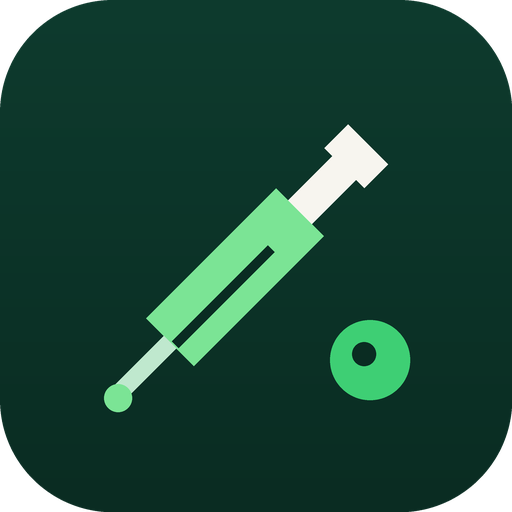
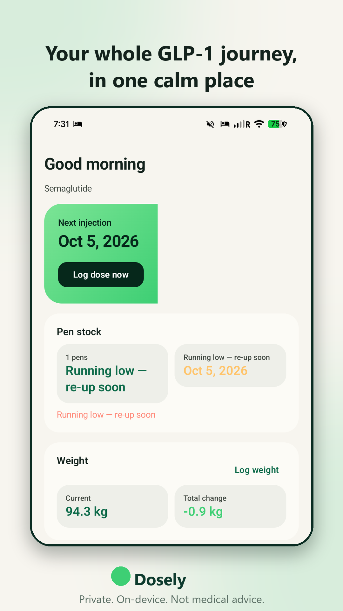
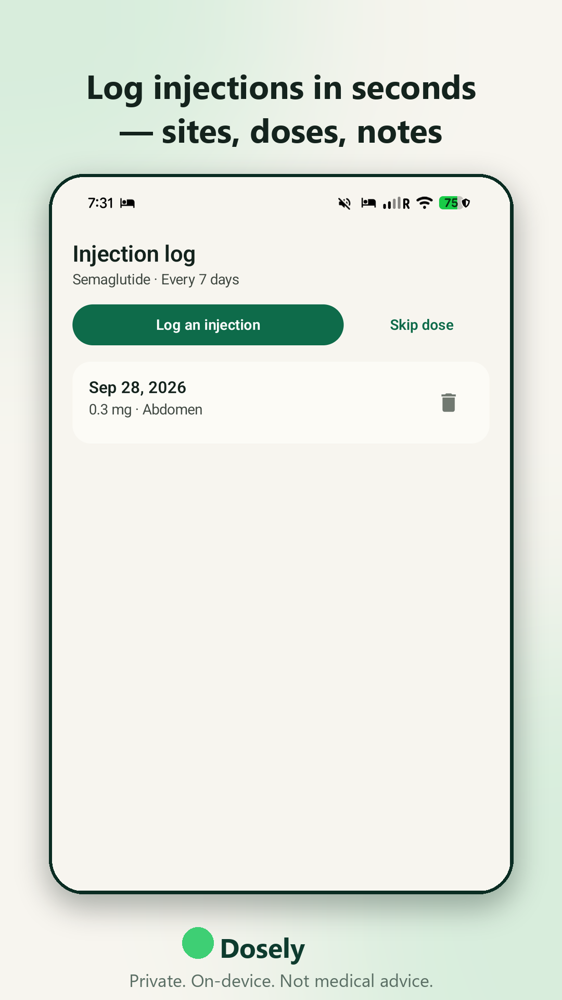
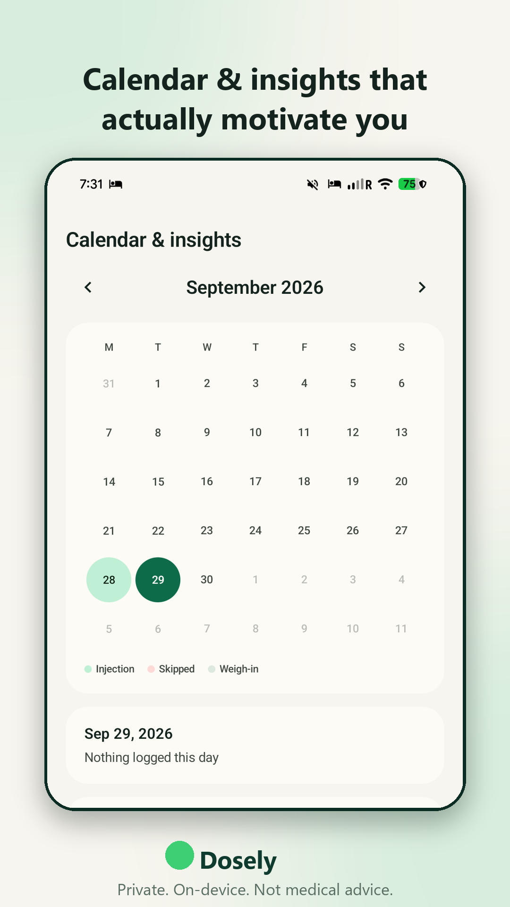
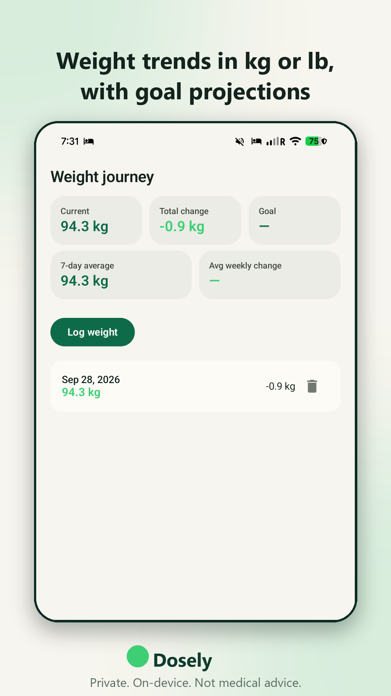
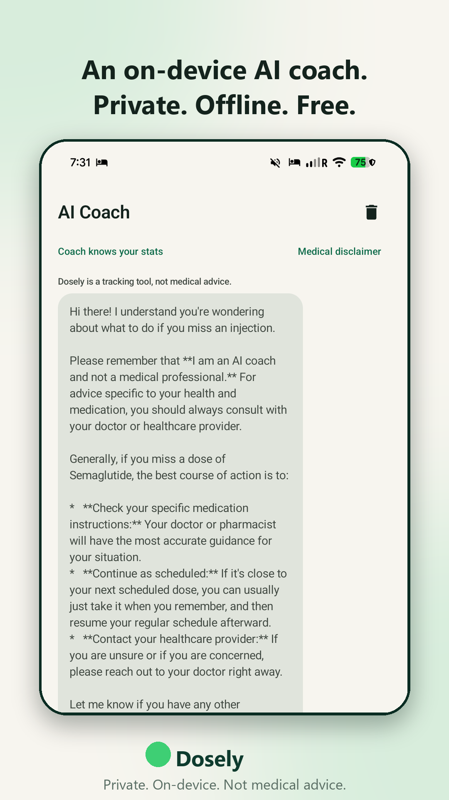
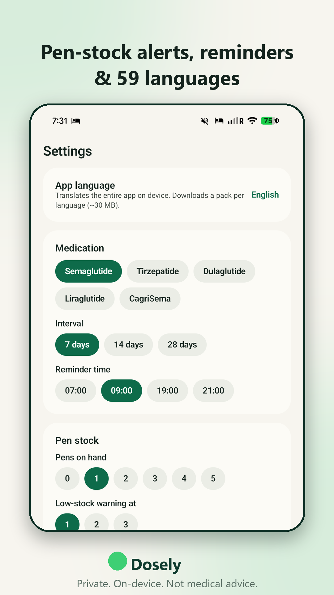

  

<h1 align="center">Dosely 💉</h1>

  <strong>Your private companion for the GLP-1 journey — injections, pen stock, weight, and an on-device AI coach. No account. No cloud. No nonsense.</strong>

  
  
  
  
  

---

## 🚧 Coming soon to Google Play

Dosely is in final testing and heading to the Google Play Store **soon**. Watch this repo
(Watch → Releases) or check the [project website](https://chartmann1590.github.io/dosely/) —
announcements land there first.

## ✨ What is Dosely?

Dosely helps people on GLP-1 medications (semaglutide, tirzepatide, dulaglutide,
liraglutide, CagriSema) stay on track with **everything that matters — and nothing that
doesn't**:

| | |
|---|---|
| 💉 **Injection tracking** | Log doses in seconds — medication, mg, injection site, notes. Titration-aware schedule suggestions. |
| 🖊️ **Pen stock & re-up alerts** | A pen is deducted per injection. Low-stock and out-of-stock warnings arrive **before** you run dry. |
| ⚖️ **Weight journey** | Start weight, goal, total change, 7-day average, trend chart — in **kg or lb**. |
| 📅 **Calendar & insights** | Month view of doses, skips and weigh-ins. Streaks, adherence, projected goal date. |
| 🤖 **On-device AI coach** | Google's Gemma 4 model runs **fully offline** on your phone. Ask about nausea, nutrition, titration, habits. Nothing is uploaded — ever. |
| 🌍 **59 languages** | The entire app translates **on device** via Google ML Kit. No server round-trips. |
| 🔔 **Reminders** | Dose reminders, refill nudges, weekly weigh-in prompts. |
| 📱 **Home-screen widget** | Next dose, pen stock and latest weight at a glance. |
| 🌗 **Beautiful & dark** | Light and dark themes, smooth animated transitions. |

## 📸 See it in action

| Home | Doses | Calendar & insights |
|---|---|---|
|  |  |  |

| Weight | AI Coach | Settings |
|---|---|---|
|  |  |  |

▶️ **Promo video:** [`store_assets/video/dosely_promo.mp4`](store_assets/video/dosely_promo.mp4)

## 🔒 Privacy-first, by design

- **All health data stays on your phone** — injections, weights, notes and AI chats live in
  local storage. There is no account, no cloud sync, no analytics SDK.
- **The AI coach is offline.** The Gemma model sits in your app's private storage and runs
  on your device's CPU. Your questions never leave your phone.
- **No ads inside your health data.** The optional ad banner (which keeps Dosely free) is
  governed by Google's consent flow, and you can review choices anytime via in-app
  **Privacy options**. Details in the [Privacy Policy](PRIVACY_POLICY.md).
- Read the [Terms of Service](TERMS_OF_SERVICE.md).

> **Medical disclaimer:** Dosely is a tracking tool, **not a medical device**. It does not
> provide medical advice, diagnosis or treatment. The AI coach can make mistakes — always
> consult a qualified healthcare professional about your medication and health.

## 🌍 Languages

Dosely's UI is natively English and translates on device to **59 languages**, including:
Afrikaans · Albanian · Arabic · Belarusian · Bengali · Bulgarian · Catalan · Chinese (Simplified & Traditional) · Croatian · Czech · Danish · Dutch · English · Esperanto · Estonian · Finnish · French · Galician · Georgian · German · Greek · Gujarati · Haitian Creole · Hebrew · Hindi · Hungarian · Icelandic · Indonesian · Irish · Italian · Japanese · Kannada · Korean · Latvian · Lithuanian · Macedonian · Malay · Maltese · Marathi · Norwegian · Persian · Polish · Portuguese · Romanian · Russian · Slovak · Slovenian · Spanish · Swahili · Swedish · Tagalog · Tamil · Telugu · Thai · Turkish · Ukrainian · Urdu · Vietnamese · Welsh

## 💚 Support the project

Dosely is free and will stay free. If it helps you, consider
**[buying me a coffee ☕](https://buymeacoffee.com/charleshartmann)** — it funds the model
hosting, translation packs testing and the Play developer account.

  

## 🗺️ Roadmap

- [x] Injection + weight + pen-stock tracking
- [x] On-device Gemma AI coach
- [x] On-device translation (59 languages)
- [x] Calendar insights, widget, reminders
- [x] Google Play compliance (consent, legal, reporting)
- [ ] **Google Play release** ← we are here
- [ ] iOS version (evaluating)
- [ ] Export/backup & restore
- [ ] Wear OS complication

## 🧑‍💻 For developers

This repository contains the complete Android app (Kotlin + Jetpack Compose).
See [CONTRIBUTING.md](CONTRIBUTING.md) to build it locally, and
[SECURITY.md](SECURITY.md) to report a vulnerability. Store listing assets live in
[`store_assets/`](store_assets/README.md).

## 📄 License

Copyright © 2026 Charles Hartmann. All rights reserved. See
[LICENSE](LICENSE). The Gemma model is subject to
[Google's model terms](https://ai.google.dev/gemma/terms).
